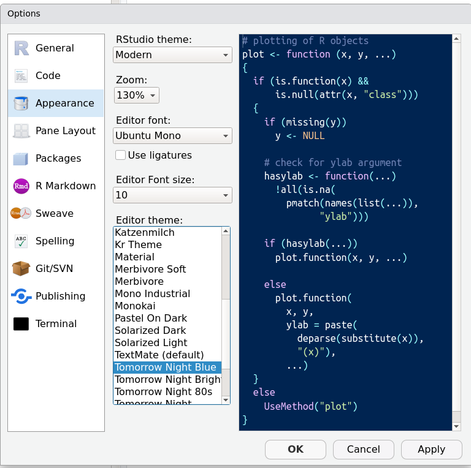
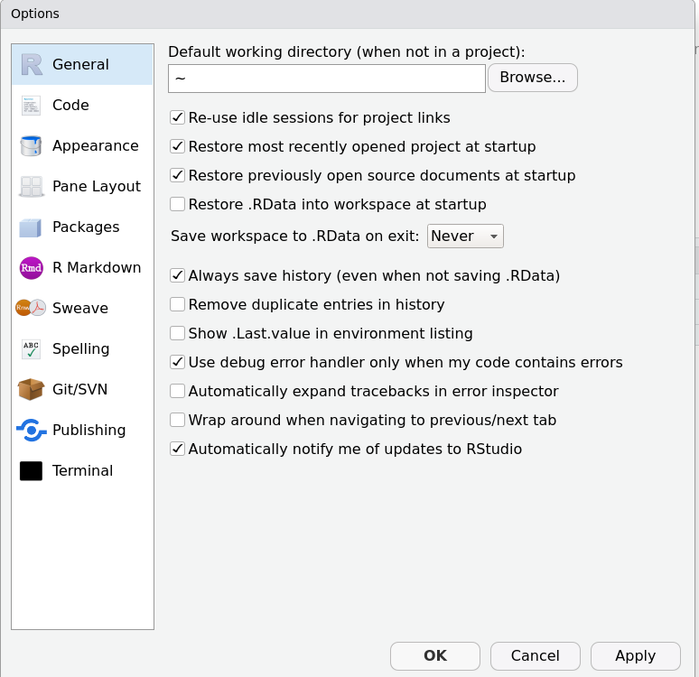

# Objetivos de esta unidad (1/2)

 * Entender qué es R
 * Navegar RStudio
 * Incorporar buenas prácticas de trabajo con proyectos y sub-directorios


--

 * Crear objetos, asignar valores, utilizar funciones y sus argumentos
 * Hacer operaciones simples
 * Trabajar con objetos de clases distintas (vectores, matrices, de naturaleza lógica, numérica, de caracteres, etc.)
 * Trabajar con datos faltantes
 * Entender sobre paquetes, ayuda y más recursos
 * Comentar y guardar scripts
 
---

# Objetivos de esta unidad (2/2)


 * Importar un archivo .csv en forma de data frame
 * Manejar data frames
 * Trabajar con objetos de clases distintas
 * Convertir vectores entre factores, caracteres y numéricos
 * Manejar fechas

--

* Seleccionar algunas observaciones o columnas del data frame
* Crear nuevas variables a partir de otras
* Ejecutar pautas de control de calidad de los datos
* Pasar entre formato largo y ancho
* Unión de data frames
* Exportar los datos
 
---

# ¿Qué es R? ¿Qué es RStudio?

[Escriban sus respuestas en el chat]


--

R es un lenguaje de programación. También es un software que interpreta los scripts en el lenguaje R. El software R es libre (gratis) y abierto (podemos ver y compartir códigos).

--

RStudio es una corporación que produce, entre otras cosas, una plataforma para manejar R, conveniente para la gente vidente. 

---

# Navegando RStudio

Advertencia: mi OS es Ubuntu 18.04 en inglés. RStudio Version 1.1.456 

Veamos sus componentes.

--

En la consola: `R.version` ¿Cuál es su versión? [al chat]


--

```{r, out.width = "60%", fig.align='center', echo=FALSE}

```


---

# Trabajar por proyecto

Un directorio de trabajo y proyecto para cada trabajo.
Mostraré cómo crear un proyecto y algunos ejemplos personales. 

--

Jenny Bryan escribió un [post al respecto](https://www.tidyverse.org/blog/2017/12/workflow-vs-script/).

--

```{r, out.width = "60%", fig.align='center', echo=FALSE}

```

---

# Trabajar por proyecto

Ahora creen su propio proyecto para el curso con los subdirectorios que crean convenientes.

```{r, echo = FALSE}
library(countdown)
countdown(minutes = 5)
```

--

¿Cuál es su espacio de trabajo? 

Donde está su proyecto: `getwd()`

--

Cierren R y abran el proyecto. Luego `getwd()` en la consola. 

---

# Objetivos de esta unidad

`r  icon::fa("check")` Entender qué es R

`r  icon::fa("check")` Navegar RStudio

`r  icon::fa("check")` Incorporar buenas prácticas de trabajo con proyectos y sub-directorios

¿Preguntas?

--

 * Crear objetos, asignar valores, utilizar funciones y sus argumentos
 * Hacer operaciones simples
 * Trabajar con objetos de clases distintas (vectores, matrices, de naturaleza lógica, numérica, de caracteres, factores, etc.)
 * Trabajar con datos faltantes
 * Entender sobre paquetes, ayuda y más recursos
 * Comentar y guardar scripts
 
---

# ¡Empecemos con nuestras primeras operaciones!

En la consola:

```{r}
15 + 6

1700 / 8
```


Confesión personal: Yo uso R como calculadora

---


# ¡Empecemos con nuestras primeras operaciones!


Creemos objetos para almacenar valores con `<-`

```{r}
res_suma <- 15 + 6
res_suma

a <- 4

res_suma / a

```

--

Ahora desde un script. Para correr pueden usar CTRL + ENTER.


¿Qué otros shortcuts en R conocen? Compártanlos en el chat

---

# Algunas funciones simples en R

```{r}
a <- 40

log(a)

exp(a)

pi

sqrt(a)

round(pi, digits = 3)

```

---

# Argumentos de funciones

Los parámetros de entrada de las funciones se llaman argumentos. 

Usando `args` se pueden encontrar los argumentos de una función en particular

```{r}
args(round)
```

--

Especificando el nombre de cada argumento, se pueden escribir en cualquier orden

```{r}
round(digits = 3, x = pi)
```

---

# Vectores

Creemos un vector usando `c()` para concatenar valores

```{r}
temp_Florida <- c(26, 32, 29)
```

--

Ahora vectores de caracteres

```{r}
houses <- c("Baratheon", "Lannister", "Martell", "Stark", "Targaryen")

```

--

Los elementos de un vector de caracteres pueden tener un número distinto de caracteres (y palabras)

```{r}
nombres <- c("Cersei Lannister", "Jon Snow", "Arya Stark", "Daenerys Stormborn of House Targaryen, the First of Her Name, Queen of the Andals and the First Men, Protector of the Seven Kingdoms, the Mother of Dragons, the Khaleesi of the Great Grass Sea, the Unburnt, the Breaker of Chains")
```

```{r}
length(nombres)
```

```{r}
nchar(nombres[4])
```

---

# Vectores

```{r}
class(temp_Florida)
class(houses)
class(nombres)
```


```{r}
str(temp_Florida)
str(houses)
```

---

# Vectores


```{r}
temp_Florida + 1
```

¿`houses + 1`?

--

Podemos añadir elementos a los vectores

```{r}
(nombres <- c(nombres, "Shae"))
```

O remover elementos de los vectores

```{r}
(nombres <- nombres[-4])
```

---

# Vectores

También se puede seleccionar o remover elementos cumpliendo ciertas condiciones

```{r}
temp_Florida
temp_Florida > 30

(temp_30 <- temp_Florida[temp_Florida > 30])

which(temp_Florida > 30)
temp_Florida[which(temp_Florida > 30)]

```

---

# Vectores

También se puede seleccionar o remover elementos cumpliendo ciertas condiciones

```{r}
houses
which(houses == "Stark" | houses == "Baratheon")

```


---


Trabajo en grupos aleatorios: [15 min]

(Sugerencia: que una persona comparta su pantalla)

**1.** Creen estos vectores

```{r}
num_char <- c(1, 2, 3, "a")
num_logical <- c(1, 2, 3, TRUE)
char_logical <- c("a", "b", "c", TRUE)
tricky <- c(1, 2, 3, "4")
```

**2.** ¿De qué clase es cada vector? ¿Por qué?

**3.** ¿R considera alguna jerarquía para las clases? Si es así, ¿cuál sería?

En el GD: ./R-Rocío/02-Intro-R/Actividades hay un doc

  * Abrirlo
  * Poner los nombres de integrantes de su grupo y las respuestas bajo los nombres
 
```{r, echo = FALSE}
countdown(minutes = 15)
```

--

```{r}
num_char <- c(1, 2, 3, "a") # caracter le gana a numérico
num_logical <- c(1, 2, 3, TRUE) # numérico le gana a lógico
char_logical <- c("a", "b", "c", TRUE) # caracter le gana a lógico
tricky <- c(1, 2, 3, "4") # caracter le gana a numérico

# caracter > numérico > lógico 
```

---

# Pedir ayuda en R

* Si es sobre cómo usar una función: 
    * Si conocemos la función, usar `?` o `help()`
    * Si es de algún paquete, buscar la documentación o vignette del paquete 
      (¿qué es un paquete? Función `vignette`)
    * Abrir un issue

--

* En caso de error:
    * Revisa primero que no es un error de tipeo
    * Google is your friend. Or duckduckgo.
    * Stack Overflow. Con todos los detalles del problema, datos e incluyendo la versión de R y paquetes con los que trabajan. 

--

* No todos los mensajes en rojo son errores.

---

# Datos faltantes

R interpreta `NA` como un valor faltante. 

Hay operaciones que se pueden hacer 

```{r}
mean(temp_Florida)

temp_Florida_na <- c(temp_Florida, NA)
?mean
mean(temp_Florida_na, na.rm = TRUE)
```

---

# Datos faltantes

R interpreta `NA` como un valor faltante. 

Hay operaciones que se pueden hacer 

```{r}
# Identificando elementos que no son NA
!is.na(temp_Florida_na)

# Extrayendo elementos que no son NA
temp_Florida_na[!is.na(temp_Florida_na)]
na.omit(temp_Florida_na)
```

---

# Datos faltantes

Trabajo personal:

Hallar el valor de la correlación de Spearman entre

```{r}
temp_Florida_na
```

y 

```{r}
hum_Florida_na <- c(80,NA,78,99)
```

5 minutos y levantan la mano virtual cuando lo hayan hecho

```{r, echo = FALSE}
countdown(minutes = 5)
```


--

```{r}
cor(x = temp_Florida_na, y = hum_Florida_na, # variables
    method = "spearman", # tipo de correlación
    use = "pairwise.complete.obs") # lidiar con NAs
```

No olviden ir guardando cambios en su script!

---

# Objetivos de esta unidad

`r  icon::fa("check")` Entender qué es R

`r  icon::fa("check")` Navegar RStudio

`r  icon::fa("check")` Incorporar buenas prácticas de trabajo con proyectos y sub-directorios

`r  icon::fa("check")` Crear objetos, asignar valores, utilizar funciones y sus argumentos

`r  icon::fa("check")` Hacer operaciones simples

`r  icon::fa("check")` Trabajar con objetos de clases distintas (vectores, matrices, de naturaleza lógica, numérica, de caracteres, factores, etc.)

`r  icon::fa("check")` Trabajar con datos faltantes

`r  icon::fa("check")` Entender sobre paquetes, ayuda y más recursos

`r  icon::fa("check")` Comentar y guardar scripts

¿Preguntas?

---

# Objetivos de esta unidad 


 * Importar un archivo .csv en forma de data frame
 * Manejar data frames
 * Trabajar con objetos de clases distintas
 * Convertir vectores entre factores, caracteres y numéricos
 * Manejar fechas
 * Seleccionar algunas observaciones o columnas del data frame
 * Crear nuevas variables a partir de otras
 * Ejecutar pautas de control de calidad de los datos
 * Pasar entre formato largo y ancho
 * Unión de data frames
 * Exportar los datos
 

---

# Importando datos de un archivo .csv

Utilizaremos [datos de pingüinos de Allison Horst](https://github.com/allisonhorst/palmerpenguins).

Están en el GD: ./R-Rocío/02-Intro-R/Datos/

--

```{r}
# Leyendo el archivo
path_data <- "./data/"
name_file <- paste0(path_data, "penguins.csv")

dataset <- read.csv(name_file) # para .txt, ver read.table

head(dataset) 

```

---

# Importando datos de un archivo .csv

```{r}
str(dataset)
```

--

```{r}
class(dataset)
```


---

# Importando datos de un archivo .csv

```{r}
summary(dataset)
```

---

# Seleccionando filas y columnas

```{r}
dataset[1,1] # observación en la 1ra fila y 1ra columna

dataset[,1] # todas las observaciones de la 1ra columna

```

---

# Seleccionando filas y columnas

```{r}
dataset[2:3,2] # todas las observaciones de la 2da y 3ra fila, y 2da columna

dataset[dataset$bill_depth_mm > 20,] # todas las observaciones que tengan bill_depth > 20mm
```

---

# Factores

```{r}
levels(dataset$species)

nlevels(dataset$species)
```

Si quieren añadir más filas al data frame, recordar que en las columnas que son factores, sólo se puede añadir valores que concuerden con los niveles de los factores existentes.

--

Para convertir factores en caracteres:

```{r}
head(as.character(dataset$species))
```

---

# Factores

Para convertir factor en numérico:

```{r}
# Ejemplo
year <- factor(c(2019,2020,2018))
year
# Como lo hago yo:
as.numeric(as.character(year))
# Como se recomienda hacer:
as.numeric(levels(year))[year]
```

---

# Fechas

Utilizaremos otro ejemplo de archivo de entrada.

```{r, eval = FALSE}
download.file(url = "https://ndownloader.figshare.com/files/2292169",
              destfile = paste0(path_data,"portal_data_joined.csv"))
```

```{r}
surveys <- read.csv(paste0(path_data,"portal_data_joined.csv"), stringsAsFactors = FALSE)
head(surveys)
```

---

# Fechas

```{r}
str(surveys)
```


---

# Fechas

```{r}
surveys$fecha_chr <- paste(surveys$year, surveys$month, surveys$day, sep = "-")
head(surveys,4)
```

--

Convirtiendo a un formato de fecha utilizado por R:

```{r}
# Calendar date-time object
surveys$fecha <- as.POSIXct(strptime(surveys$fecha_chr, "%Y-%m-%d"), tz = "") 
# tz = "" uses the local time zone of my computer; it would be better to have everything in UTC (tz = "GMT")
```

---

# Fechas

```{r}
str(surveys$fecha)
summary(surveys$fecha)
```

--

¿Qué pasó con los 129 datos faltantes de fecha?


---

# Fechas

```{r}
head(surveys[is.na(surveys$fecha),])
```

---

# Fechas y horas

Husos horarios con el paquete `lubridate`

Utilizaremos los datos de jugadas de los Lakers del paquete.

```{r, message=FALSE, warning=FALSE}
library(lubridate)
data(lakers)
str(lakers)
```

---

# Fechas y horas

Obtenemos primero una columna de fecha y hora

```{r}
lakers$Fecha <- as.POSIXct(strptime(paste(lakers$date, lakers$time, sep = " "), 
                                    format = "%Y%m%d %H:%M"), 
                           tz = "America/Los_Angeles")

str(lakers)
```
---

# Fechas y horas

```{r}
head(lakers$Fecha)
```


**Primer caso:** Imaginemos que nos equivocamos y en realidad el huso horario era de New York.

Usamos la función `force_tz` para corregir

```{r}
lakers$Fecha_corregida <- force_tz(lakers$Fecha, tzone = "America/New_York")
head(lakers$Fecha_corregida)
```

---

# Fechas y horas

```{r}
head(lakers$Fecha)
```

**Segundo caso:** El huso sí era el de Los Angeles, pero ahora queremos convertir a hora de New York

Usamos la función `with_tz` para corregir

```{r}
lakers$Fecha_NY <- with_tz(lakers$Fecha, tzone = "America/New_York")
head(lakers$Fecha_NY)
```

---

# Control de calidad

¿Qué condiciones chequear en los datos para detectar problemas?

(5 minutos para poner ideas en el google doc)


```{r, echo = FALSE}
library(countdown)

countdown(minutes = 5, seconds = 0)
```

---

# Pipes y funciones en tidyverse

```{r, message=FALSE}
library(dplyr) # funciones tipo filter, select, mutate, group_by, arrange, count

# Filtrando NAs en la variable weight del objeto surveys y creando nuevo objeto surveys_gw
surveys_gw <- surveys %>% 
  filter(!is.na(weight))
```

--

```{r}

# 1. Filtrando NAs en la variable weight del objeto surveys
# 2. agrupando por plot_id y genus
# 3. En cada grupo, calcular el promedio de weight
(surveys_gw <- surveys %>% 
  filter(!is.na(weight)) %>% 
    group_by(plot_id, genus) %>% 
    summarize(mean_weight = mean(weight))
)

```

---

# Pipes, spread y gather

Veamos nuevamente el resultado

```{r}
surveys_gw
```

¿Y si quisiéramos una columna por genus y no todos los genus en una columna?

Hay que extender la data frame. 


---

# Pipes, spread y gather

Extendiendo el/la data frame con una columna por genus

```{r}
library(tidyr) # para spread y gather
(surveys_spread <- surveys_gw %>% 
  spread(key = genus, value = mean_weight))
```

¿Y si quisiéramos hacer lo opuesto?

---

# Pipes, spread y gather

Comprimiento el/la data frame con una sola columna para genus

```{r}
# library(tidyr) # para spread y gather
(surveys_gather <- surveys_spread %>% 
  gather(key = genus, value = mean_weight, -plot_id))
```

---

# Unión de data frames

```{r}
library(nycflights13) # datos de aviones, aeropuertos y vuelos en formato tibble
data("airlines") 
head(airlines, 1) # Pueden usar View 
data("airports")
head(airports,1)
```

---

# Unión de data frames

```{r}
data("flights")
head(flights,1)
data("weather")
head(weather,1)
```


---

# Unión de data frames

Si quisiera un data frame de vuelos con el nombre de la compañía aérea:

```{r}
flights_airlines <- left_join(flights, airlines, by = "carrier")
```

--

**Desafíos personales:** (10 minutos)

**Desafío 1:** ¿Y si quisiera un data frame de vuelos con datos meteorológicos del aeropuerto de salida a la hora de salida?

**Desafío 2:** quedarse con un data frame que incluya sólo información de la salida de los vuelos, y sólo algunas variables meteorológicas. 

**Desafío 3:** en base a estos datos, hacer un resumen meteorológico de cada aeropuerto

```{r, echo = FALSE}
# library(countdown)

countdown(minutes = 10, seconds = 0)
```

---

# Unión de data frames

```{r}
left_join(flights, weather, by = c("origin","time_hour"))
```

---

# Exportando datos

```{r}
departure_weather <- left_join(flights, weather)
```

```{r, eval = FALSE}
write.csv(x = departure_weather, file = paste0(path_data, "depart_weather.csv"))
```

--

Para seguir trabajando en R, también se puede guardar como objeto R:

```{r, eval = FALSE}
saveRDS(object = departure_weather, file = paste0(path_data, "depart_weather.rds"))
```

Cargar datos .rds:

```{r, eval = FALSE}
departure_weather <- readRDS(file = paste0(path_data, "depart_weather.rds"))
```

---

# Trabajando con sus datos (en grupos)

1. Importen sus datos a R, como data frame
2. Que todas las columnas estén en el formato correcto
3. Realicen un control de calidad de sus datos
4. Produzcan resúmenes de variables, cálculos de correlación, arreglen problemas de NA, y crucen data frames si tienen varias
5. Exportar datos o guardarlos como objeto R. 

* Asegurarse de que su script esté bien comentado
* Volver y modificar la hoja de cálculo y ReadMe si es necesario

[30 min?] Pasaré por los grupos.

---

# Bibliografía

Para preparar esta unidad se utilizó:

Material y datos de: 
  * [Data Carpentry](https://datacarpentry.org/R-ecology-lesson/)

Datos de: 
  * [Hadley Wickham (2019). nycflights13: Flights that Departed NYC in 2013. R package version 1.0.1.](https://CRAN.R-project.org/package=nycflights13)
  * [Horst AM, Hill AP, Gorman KB (2020). palmerpenguins: Palmer Archipelago (Antarctica) penguin data. R
  package version 0.1.0. doi: 10.5281/zenodo.3960218.](https://allisonhorst.github.io/palmerpenguins/) 
  
---

# Bibliografía

Más:

  * Fechas:
    * [Lista de husos horarios](https://en.wikipedia.org/wiki/List_of_tz_database_time_zones)
    * [Converting time zones in R: tips, tricks and pitfalls](https://blog.revolutionanalytics.com/2009/06/converting-time-zones.html)
    * [How do you convert dates/times from one time zone to another in R?](https://stackoverflow.com/questions/1395117/how-do-you-convert-dates-times-from-one-time-zone-to-another-in-r)

