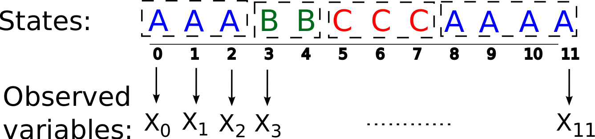

# Objetivos de esta unidad 

 * Introducir los modelos ocultos de Markov
 * Implementar estos modelos en R con `momentuHMM`
    * Modelo simple con 3 estados
    * Modelo con 4 estados con restricciones en las transiciones
    * Modelo con covariables condicionando las transiciones y variables observadas
  * Referencias sobre más teoría y práctica
 
---

# Modelos ocultos de Markov

¿Qué son?

\visible<2-3>{

```{r, out.width = "65%", fig.align='center', echo=FALSE}

```
}

\vspace{1cm}

\visible<3>{
$\begin{array}{cccc}
\text{Estado: } & \begin{array}{ccc}
S_{t-1} & \rightarrow & S_t
 \end{array}
 & \rightarrow & S_{t+1} \\
 & \begin{array}{ccc}
 \downarrow & & \invisible{\text{bla}} \downarrow
 \end{array}
 & & \downarrow \\
\text{Obs: } &
\begin{array}{ccc}
Z_{t-1} & & Z_t
\end{array}
 & & Z_{t+1}
\end{array}$
}

---

# Modelos ocultos de Markov

$\begin{array}{cccc}
\text{Estado: } & \begin{array}{ccc}
S_{t-1} & \rightarrow & S_t
 \end{array}
 & \rightarrow & S_{t+1} \\
 & \begin{array}{ccc}
 \downarrow & & \invisible{\text{bla}} \downarrow
 \end{array}
 & & \downarrow \\
\text{Obs: } &
\begin{array}{ccc}
Z_{t-1} & & Z_t
\end{array}
 & & Z_{t+1}
\end{array}$

. . .

- Proceso de Markov escondido y subyacente $\{S_t\}$:
  $P(S_t = s_t \mid S_{t-1} = s_{t-1}) = P(S_t = j \mid S_{t-1} = i) = \gamma_{ij}$

. . .

- Proceso de observación dependiente del estado $\{Z_t\}$:
  $P(Z_t=z_t\mid S_t=s_t)$
  
. . .

- t es discreto

---

Trabajaremos con datos de [\textcolor{blue}{Michelot et al. 2017}](https://esajournals.onlinelibrary.wiley.com/doi/abs/10.1002/ecy.1880).

- Southern elephant seal (*Mirounga leonina*)
- Tracks Argos de 15 individuos (8 hembras adultas y 7 machos sub-adultos) en Kerguelen.
- Pre-procesamiento de datos con modelos espacio-estado. 

Los datos están en el GD: ./R-Rocío/05-HMM/Datos/

\pause

```{r data, echo = TRUE}
path_data <- "./data/"
trackData <- read.csv(paste0(path_data,"seal_tracks.csv"))
head(trackData)
```

---

```{r}
str(trackData)
```

\pause

Los pasos de tiempo son regulares. 

```{r}
dates <- as.character(trackData[,4])
time_dif <- diff.Date(as.POSIXct(dates, tz = "GMT"))
head(time_dif)
```

---

# Preparando los datos

Intentaremos identificar estados escondidos a partir de los desplazamientos (step)
y el cambio de ángulo (angle).

`momentuHMM` permite calcularlos fácilmente con `prepData`

\pause

```{r fitMomentu, echo = TRUE, message=FALSE}
library(momentuHMM)
data <- prepData(trackData, type = "LL",
               coordNames = c("lon", "lat"))
head(data)
```

---

Se pueden explorar visualmente los datos del nuevo objeto `momentuHMM` con `plot`

```{r plotData2, echo = TRUE, fig.width=5, fig.height=6, out.width='40%'}
plot(x=data,compact=TRUE,ask=FALSE)
```

---

# Modelo oculto de Markov de 3 estados

- Se espera identificar 3 estados como proxies de: trayecto (T), búsqueda (B) y forrajeo (F)
- Variables observadas: step y angle

**Parámetros del modelo:**

Matriz de (probabilidades de) transición:
 
$\Gamma= \begin{bmatrix}
        & Trayecto & Busqueda & Forrajeo \\[0.3em]
       Trayecto & \gamma_{TT} & \gamma_{TB} & \gamma_{TF}           \\[0.3em]
       Busqueda & \gamma_{BT} & \gamma_{BB} & \gamma_{BF} \\[0.3em]
       Forrajeo & \gamma_{FT} & \gamma_{FB} & \gamma_{FF}
     \end{bmatrix}$

Probabilidades iniciales:

$\Pi = [\pi_{T}, \pi_{B}, \pi_{F}]$     
     
8 parámetros a estimar
  


---

# Modelo oculto de Markov de 3 estados

**Parámetros del modelo:**

L: step (desplazamiento)

$L_t | S_t=s_t \sim Gamma(\text{shape},\text{scale})$

\vspace{-3cm}

\begin{tabular}{cc}
\begin{minipage}{5cm}
Valores iniciales:\\
$L_t | S_t=T \sim Gamma(40,10)$\\
$L_t | S_t=B \sim Gamma(20,8)$\\
$L_t | S_t=F \sim Gamma(8,5)$\\
\end{minipage}  \hspace{.5cm}
\begin{minipage}{5cm}
\vspace{4cm}
\includegraphics[scale=0.2]{./img/Gamma.png}
\end{minipage}
\end{tabular}

---

# Modelo oculto de Markov de 3 estados

**Parámetros del modelo:**

$\Theta$: angle (cambio de ángulo)

$\Theta_t | S_t=s_t \sim VM(\text{location},\text{concentration})$

\vspace{-2cm}

\begin{tabular}{cc}
\begin{minipage}{6cm}
Valores iniciales:\\
$\Theta_t | S_t=T \sim VM(-0.001,7)$\\
$\Theta_t | S_t=B \sim VM(0,4)$\\
$\Theta_t | S_t=F \sim VM(\pi,0.1)$\\

Son 12 parámetros a estimar para el modelo de observación.
20 en total.
\end{minipage}  \hspace{.1cm}
\begin{minipage}{4cm}
\vspace{4cm}
\includegraphics[scale=0.17]{./img/VonMises.png}
\end{minipage}
\end{tabular}

---

# Modelo oculto de Markov de 3 estados

Ahora en R:

Valores iniciales para los parámetros en el modelo

```{r iniparM1, echo = TRUE}
stateNames <- c("trayecto","busqueda","forrajeo")
shape_0 <- c(40,20,8)
scale_0 <- c(10,8,5)
stepPar0 <- c(shape_0,scale_0)
location_0 <- c(-0.001,0,3.14)
concentration_0 <- c(7,4,0.1)
anglePar0 <- c(location_0,concentration_0)
```

---

# Modelo oculto de Markov de 3 estados

Ahora ajustando el modelo

```{r fithmmM1, echo = TRUE, message=FALSE}
m1 <- fitHMM(data=data, nbStates=3,
             dist=list(step="gamma",angle="vm"),
             Par0=list(step=stepPar0, angle=anglePar0),
             estAngleMean = list(angle=TRUE),
             stateNames = stateNames)
```

```{r, eval=FALSE,  message=FALSE}
print(m1) #estimaciones
```

---

# Modelo oculto de Markov de 3 estados

```{r, echo = FALSE, message=FALSE}
print(m1) #estimaciones
```

---

# Modelo oculto de Markov de 3 estados

Matriz de transición:

$\Gamma= \begin{bmatrix}
        & Trayecto & Busqueda & Forrajeo \\[0.3em]
        Trayecto & 0.97 & 0.03 & 0.00           \\[0.3em]
       Busqueda & 0.03 & 0.87 & 0.10 \\[0.3em]
       Forrajeo & 0.00 & 0.05 & 0.95
     \end{bmatrix}$

\vspace{1cm}

Probabilidades iniciales:

$\Pi = [0.84, 0.11, 0.05]$

---

# Modelo oculto de Markov de 3 estados

**Reconstruyendo la secuencia de estados:**

El algoritmo Viterbi:

$\displaystyle{arg\,max_{S_0=s_0,...,S_t=s_t}} P(S_0=s_0,...,S_t=s_t\mid Z_0=z_0,...,Z_t=z_t)$

En R:

```{r viterbiM1, echo = TRUE}
states.1 <- as.factor(viterbi(m1)) # reconstrucción de estados
head(states.1)
prop.table(table(states.1))
```

---

# Modelo oculto de Markov de 3 estados

**Salidas gráficas**

```{r plotOutputsM1, echo = TRUE, fig.width=5, fig.height=6, out.width='30%'}
plot(m1, plotCI = TRUE, plotTracks=FALSE)
```

---

# Modelo oculto de Markov de 3 estados

¿Cómo validar el modelo? \pause Diagnóstico de supuestos, simulaciones, sentido ecológico

\pause

**Diagnóstico de supuestos:**

```{r plotResidualsM1, echo = TRUE, fig.width=8, fig.height=6, message=FALSE, out.width='50%', warning=FALSE}
plotPR(m1)
```

---

# Desafío

2 opciones:

1. Utilizar sus propios datos. 

2. Utilizar los datos de albatroz de [Clay et al. 2020](https://raw.githubusercontent.com/tommyclay/alba-wind-behaviour/master/Data_inputs/GPS_SouthGeorgia_2012.csv)

* Ajustar un HMM a los datos y hacer un diagnóstico de residuos. 
* Hacer gráficos 
* Interpretar los resultados.
* * Dentro del GD: CURSO R-biologging/R-Rocío/05-HMM/Actividades/, 
  * Crear una carpeta ahí con sus iniciales, e.g. "CI-CZ"
  * Un google doc con sus nombres
  * Un script R
  * Archivo(s) de gráfico (o reporte Rmarkdown con R + salidas)
  * Si prefieren hacer el trabajo individualmente, dentro de la carpeta del grupo, creen subcarpetas por persona
  
```{r, echo= FALSE, eval=FALSE}
path_data <- "./data/"
alba <- read.csv(paste0(path_data,"GPS_SouthGeorgia_2012.csv"), 
                 stringsAsFactors = TRUE)

library(momentuHMM)

alba_mom <- prepData(alba, type = "LL", coordNames = c("x", "y"))
plot(x = alba_mom)
 
# initial values               
shape_0 <- c(18.73,5.59, 0.62) 
scale_0 <- c(5.59, 6.47, 0.32) 
zero_0 <- rep(sum(alba_mom$step == 0, na.rm = TRUE)/dim(alba_mom)[1],3)
stepPar0 <- c(shape_0,scale_0, zero_0) 

# assigning turning angles based on first code
location_0 <- c(0.0022,  -0.004, 0.035) 
concentration_0 <- c(52.97,  1.31,  51.27)
anglePar0 <- c(location_0,concentration_0)

stateNames<-c("travel","search", "rest")

m1 <- fitHMM(data=alba_mom, nbStates=3,
             dist=list(step="gamma",angle="vm"),
             Par0=list(step=stepPar0, angle=anglePar0),
             estAngleMean = list(angle=TRUE),
             stateNames = stateNames)
save(m1, file = "hmm_SG.RData")
```
  

---

# Modelo oculto de Markov de 4 estados

- Se espera identificar 4 estados como proxies de: salida (S), búsqueda (B), forrajeo (F) y entrada (E)
- No todas las transiciones son posibles
- Variables observadas: step y angle

El modelo de observación es casi el mismo, sólo añadimos otro estado.

Empecemos por ahí.

---

# Modelo oculto de Markov de 4 estados

**Parámetros del modelo:**

L: step (desplazamiento)

$L_t | S_t=s_t \sim Gamma(\text{shape},\text{scale})$

\vspace{-3cm}

\begin{tabular}{cc}
\begin{minipage}{5cm}
Valores iniciales:\\
$L_t | S_t=S \sim Gamma(40,10)$\\
$L_t | S_t=B \sim Gamma(20,8)$\\
$L_t | S_t=F \sim Gamma(8,5)$\\
$L_t | S_t=E \sim Gamma(40,10)$\\
\end{minipage}  \hspace{.5cm}
\begin{minipage}{5cm}
\vspace{4cm}
\includegraphics[scale=0.2]{./img/Gamma.png}
\end{minipage}
\end{tabular}

---

# Modelo oculto de Markov de 4 estados

**Parámetros del modelo:**

$\Theta$: angle (cambio de ángulo)

$\Theta_t | S_t=s_t \sim VM(\text{location},\text{concentration})$

\vspace{-2cm}

\begin{tabular}{cc}
\begin{minipage}{6cm}
Valores iniciales:\\
$\Theta_t | S_t=S \sim VM(-0.001,7)$\\
$\Theta_t | S_t=B \sim VM(0,4)$\\
$\Theta_t | S_t=F \sim VM(\pi,0.1)$\\
$\Theta_t | S_t=E \sim VM(-0.001,7)$\\

Son 16 parámetros a estimar para el modelo de observación.
\end{minipage}  \hspace{.1cm}
\begin{minipage}{4cm}
\vspace{4cm}
\includegraphics[scale=0.17]{./img/VonMises.png}
\end{minipage}
\end{tabular}

---

# Modelo oculto de Markov de 4 estados

Ahora en R:

Valores iniciales para los parámetros en el modelo

```{r iniparM2, echo = TRUE}
stateNames <- c("salida","busqueda","forrajeo","entrada")
shape_0 <- c(40,20,8,40)
scale_0 <- c(10,8,5,10)
stepPar0 <- c(shape_0,scale_0)
location_0 <- c(-0.001,0,3.14,-0.001)
concentration_0 <- c(7,4,0.1,7)
anglePar0 <- c(location_0,concentration_0)
```

---

# Modelo oculto de Markov de 4 estados

No todas las transiciones son posibles

$\begin{bmatrix}
                & Salida  & Busqueda  & Forrajeo  & Entrada \\[0.3em]
        Salida  &         &           &    0      & 0         \\[0.3em]
       Busqueda &   0     &           &           &           \\[0.3em]
       Forrajeo &   0     &           &           & 0         \\[0.3em]
       Entrada  &   0     &     0     &   0       &           \\
     \end{bmatrix}$

\vspace{5cm}

---

# Modelo oculto de Markov de 4 estados

No todas las transiciones son posibles

$\begin{bmatrix}
                & Salida  & Busqueda  & Forrajeo  & Entrada \\[0.3em]
        Salida  & \gamma_{SS} & \gamma_{SB} &    0      & 0         \\[0.3em]
       Busqueda &   0     & \gamma_{BB} & \gamma_{BF} & \gamma_{BE} \\[0.3em]
       Forrajeo &   0     & \gamma_{FB} & \gamma_{FF} & 0         \\[0.3em]
       Entrada  &   0     &     0     &   0       &   1
     \end{bmatrix}$

\pause

En `momentuHMM`, $\gamma_{ij} = logit^{-1}(\beta X)$; X: covariables

Si no hay covariables, entonces $\gamma_{ij} = logit^{-1}(\beta_0) = \displaystyle\frac{1}{1+\exp{(-\beta_0)}}$

Entonces, para $\gamma_{ij}\approx 0$, $\beta_0$: un número negativo bien grande; e.g. $-100$

Para este ejemplo:

```{r betaM2, echo = TRUE}
beta_M2=c(NA,-100,-100, -100, NA, NA, -100, NA, -100, -100,
       -100, -100)
```

---

# Modelo oculto de Markov de 4 estados

Ahora ajustando el modelo

```{r fithmmM2, echo = TRUE, message=FALSE}
m2 <- fitHMM(data=data, nbStates=4,
             dist=list(step="gamma",angle="vm"),
             Par0=list(step=stepPar0, angle=anglePar0),
             estAngleMean = list(angle=TRUE),
             fixPar=list(beta=beta_M2),
             stateNames = stateNames)
```

```{r, eval=FALSE,  message=FALSE}
print(m2) #estimaciones
```

---

# Modelo oculto de Markov de 4 estados

```{r, eval=TRUE, echo = FALSE,  message=FALSE}
print(m2) #estimaciones
```

---

# Modelo oculto de Markov de 4 estados

A partir de los $\beta$ estimados se calcula la matriz de transición:

$\begin{bmatrix}
                & Salida  & Busqueda  & Forrajeo  & Entrada \\[0.3em]
        Salida  & 0.99 & 0.01 &    0      & 0         \\[0.3em]
       Busqueda &   0     & 0.89 & 0.10 & 0.01 \\[0.3em]
       Forrajeo &   0     & 0.05 & 0.95 & 0         \\[0.3em]
       Entrada  &   0     &     0     &   0       &   1
     \end{bmatrix}$

\vspace{1cm}

Probabilidades iniciales:

$\Pi = [1.00, 0, 0, 0]$

---

# Modelo oculto de Markov de 4 estados

**Reconstruyendo la secuencia de estados:**

```{r viterbiM2, echo = TRUE}
states.2 <- as.factor(viterbi(m2)) # reconstrucción de estados
head(states.2)
prop.table(table(states.2))
```

---

# Modelo oculto de Markov de 4 estados

**Salidas gráficas**

```{r plotOutputsM2, echo = TRUE, fig.width=5, fig.height=6, out.width='30%'}
plot(m2, plotCI = TRUE, plotTracks=FALSE)
```

---

# Modelo oculto de Markov de 4 estados

**Diagnóstico de supuestos:**

```{r plotResidualsM2, echo = TRUE, fig.width=8, fig.height=6, message=FALSE, out.width='50%', warning=FALSE}
plotPR(m2)
```

---

# Modelo oculto de Markov de 4 estados con covariables

- Se espera identificar 4 estados como proxies de: salida (S), búsqueda (B), forrajeo (F) y entrada (E)
- No todas las transiciones son posibles
- Variables observadas: step y angle
- Algunas probabilidades de transición dependen de covariables
- El modelo observado también depende de covariables
- Covariables: distancia y dirección respecto a la colonia, tiempo desde la salida de la colonia

Empecemos con el cálculo de las covariables.

---

# Modelo oculto de Markov de 4 estados con covariables

Utilizando `centers` en `prepData`, se calcula distancia a ese o esos centros. 
En este caso, la colonia.

```{r distcol, echo = TRUE}
center <- matrix(c(70,-49),nrow=1,dimnames=list("colony"))
data <- prepData(data=trackData, type="LL", centers=center,
                 coordNames = c("lon", "lat"))
head(data[,c(1:3,7,8)])
```

---

# Modelo oculto de Markov de 4 estados con covariables

Asumiendo que sale de la colonia desde el inicio del seguimiento:

```{r timecol, echo = TRUE}
time <- NULL # objeto vacío
for(id in unique(data$ID)) {
  nbSubObs <- sum(data$ID==id) # número de obs con ese ID
  time <- c(time, ((1:nbSubObs)-1)*9.6) # tiempo en horas
}
data$time <- time

data[1:3,c(1,4,7:9)]
```

---

# Modelo oculto de Markov de 4 estados con covariables

No todas las transiciones son posibles

\begin{tabular}{cc}
\begin{minipage}{5cm}
\begin{tabular}{c|cccc}
    & S & B & F & E \\
\hline
 S  & $\gamma_{SS}$ &  $\gamma_{SB}$  & 0 & 0 \\
 B  & 0 & $\gamma_{BB}$  & $\gamma_{BF}$  & $\gamma_{BE}$  \\
 F  & 0 & $\gamma_{FB}$  & $\gamma_{FF}$  & 0 \\
 E  & 0 & 0 & 0 & 1  \\
 \end{tabular} \pause
\end{minipage} \hspace{0.5cm}
\begin{minipage}{5cm}
Michelot et al (2017): '(...) Animals often make fast trips away from the colony and tend to switch into other movement modes once they have reached foraging grounds'
\end{minipage}
\end{tabular}

\pause

Entonces, la distancia a la colonia tendría una efecto sobre la probabilidad de transición entre salida y búsqueda 

\pause $\gamma_{ij} = logit^{-1}(\beta X)$ \pause $\rightarrow$
$\gamma_{SB}^{(t)} = logit^{-1}(\beta_{0}^{(SB)} +  \beta_{1}^{(SB)} d_t)$

$d_t$: distancia del individuo a la colonia en el tiempo t

\pause

$\gamma_{SB}^{(t)} = \displaystyle\frac{\exp{(\beta_{0}^{(SB)} +  \beta_{1}^{(SB)} d_t)}}{1+\exp{(\beta_{0}^{(SB)} +  \beta_{1}^{(SB)} d_t)}}$

---

# Modelo oculto de Markov de 4 estados con covariables

No todas las transiciones son posibles

\begin{tabular}{cc}
\begin{minipage}{5cm}
\begin{tabular}{c|cccc}
    & S & B & F & E \\
\hline
 S  & $\gamma_{SS}$ &  $\gamma_{SB}$  & 0 & 0 \\
 B  & 0 & $\gamma_{BB}$  & $\gamma_{BF}$  & $\gamma_{BE}$  \\
 F  & 0 & $\gamma_{FB}$  & $\gamma_{FF}$  & 0 \\
 E  & 0 & 0 & 0 & 1  \\
 \end{tabular} \pause
\end{minipage} \hspace{0.5cm}
\begin{minipage}{5cm}
Michelot et al (2017): '... time constraints to go back to the colony ...'
\end{minipage}
\end{tabular}

\pause

$\gamma_{BE}^{(t)} = \displaystyle\frac{\exp{(\beta_{0}^{(BE)} +  \beta_{1}^{(BE)} (t-t_0))}}{1+\exp{(\beta_{0}^{(BE)} +  \beta_{1}^{(BE)} (t-t_0))} + \exp{(\beta_{0}^{BF})}}$

$\gamma_{BF}^{(t)} = \displaystyle\frac{\exp{(\beta_{0}^{(BF)})}}{1+\exp{(\beta_{0}^{(BE)} +  \beta_{1}^{(BE)} (t-t_0))} + \exp{(\beta_{0}^{BF})}}$

---

# Modelo oculto de Markov de 4 estados con covariables

**Parámetros del modelo:**

¿Qué parámetros $\beta$ estimar? NA para aquellos, 0 los que no, y -100 para las transiciones que no deberían ocurrir

\begin{tabular}{p{.7cm}|p{.3cm}p{.3cm}p{.3cm}p{.3cm}p{.3cm}p{.3cm}p{.3cm}p{.3cm}p{.3cm}p{.3cm}p{.3cm}p{.3cm}}
& \begin{scriptsize} SB \end{scriptsize}
& \begin{scriptsize} SF \end{scriptsize}
& \begin{scriptsize} SE \end{scriptsize}
& \begin{scriptsize} BS \end{scriptsize}
& \begin{scriptsize} BF \end{scriptsize}
& \begin{scriptsize} BE \end{scriptsize}
& \begin{scriptsize} FS \end{scriptsize}
& \begin{scriptsize} FB \end{scriptsize}
& \begin{scriptsize} FE \end{scriptsize}
& \begin{scriptsize} ES \end{scriptsize}
& \begin{scriptsize} EB \end{scriptsize}
& \begin{scriptsize} EF \end{scriptsize}\\
\hline
$\beta_0$ & & & & & & & & & & & & \\
$d_t$ & & & & & & & & & & & & \\
\begin{scriptsize} $t-t_0$ \end{scriptsize} & & & & & & & & & & & & \\
\end{tabular}

```{r}
beta <- matrix(c(NA,-100,-100,-100,NA,NA,-100,NA,-100,
                 -100,-100,-100,
                 NA,0,0,0,0,0,0,0,0,0,0,0,
                 0,0,0,0,0,NA,0,0,0,0,0,0),
               nrow=3,byrow=TRUE)
```

---

# Modelo oculto de Markov de 4 estados con covariables

**Parámetros del modelo:**

¿Qué parámetros $\beta$ estimar? NA para aquellos, 0 los que no, y -100 para las transiciones que no deberían ocurrir

```{r}
beta <- matrix(c(NA,-100,-100,-100,NA,NA,-100,NA,-100,
                 -100,-100,-100,
                 NA,0,0,0,0,0,0,0,0,0,0,0,
                 0,0,0,0,0,NA,0,0,0,0,0,0),
               nrow=3,byrow=TRUE)
```

```{r probM3, echo = TRUE}
formula <- ~ colony.dist + time
```


---

# Modelo oculto de Markov de 4 estados con covariables

**Parámetros del modelo:**

Vamos a modelar la salida y la entrada como BRWs, con repulsión desde la colonia 
para la salida, y atracción hacia la colonia durante la entrada.

En `momentuHMM`, esto se expresa así:

```{r angleparM3, echo = TRUE}
angleFormula <- ~ state1(colony.angle) +
  state4(colony.angle)
fixPar <- list(angle=c(-100,100,NA,NA,NA,NA),beta=beta)
```

* 4 parámetros de concentración para estimar

* -100 para localización: en promedio, dirección opuesta a la colonia

* 100 para localización: en promedio, en dirección hacia la colonia

Esto se desprende de la regresión circular en donde 

$\mu = atan2(\sin(angle)\beta, 1 + \cos(angle)\beta)$

---

# Modelo oculto de Markov de 4 estados con covariables

**Parámetros del modelo:**

La distribución Gamma se utilizará para el desplazamiento (step).

En lugar de empezar de cero, usaremos los valores estimados por el modelo anterior
como valores iniciales para ajustar este modelo.

```{r iniparM3, echo = TRUE, results='hide', message=FALSE}
m2 <- fitHMM(data=data, nbStates=4,
             dist=list(step="gamma",angle="vm"),
             Par0=list(step=stepPar0, angle=anglePar0),
             estAngleMean = list(angle=TRUE),
             fixPar=list(beta=beta_M2),
             stateNames = stateNames)
Par0 <- getPar0(model=m2, nbStates=4,
                DM=list(angle=list(mean=angleFormula, 
                                   concentration=~1)),
                estAngleMean=list(angle=TRUE),
                circularAngleMean=list(angle=TRUE), 
                formula=formula)
```

---

# Modelo oculto de Markov de 4 estados con covariables

Ahora ajustamos el modelo

```{r fitM3, echo = TRUE, message=FALSE}
m3 <- fitHMM(data=data, nbStates=4,
             dist=list(step="gamma",angle="vm"),
             Par0=list(step=Par0$Par$step, 
                       angle=Par0$Par$angle),
             beta0=Par0$beta, fixPar=fixPar, formula=formula,
             DM=list(angle=list(mean=angleFormula, 
                                concentration=~1)),
             estAngleMean=list(angle=TRUE),
             circularAngleMean=list(angle=TRUE),
             stateNames = stateNames)
```

---

# Modelo oculto de Markov de 4 estados con covariables

**Reconstruyendo la secuencia de estados:**

```{r viterbiM3, echo = TRUE}
states.3 <- as.factor(viterbi(m3))
prop.table(table(states.3))
```

---

# Modelo oculto de Markov de 4 estados con covariables

**Diagnóstico de supuestos:**

```{r plotResidualsM3, echo = TRUE, fig.width=8, fig.height=6, message=FALSE, out.width='50%'}
plotPR(m3)
```

---

## Otras cosas que se pueden hacer

- Introducir un centro de actividad dinámico
- Otros modelos más complicados con límites en los parámetros
- Métodos de imputación de datos (e.g. usando `crawl`)
- Introducir efectos aleatorios

---

# Desafío

¿Pueden mejorar sus modelos anteriores?

* Ajustar un HMM a los datos y hacer un diagnóstico de residuos. 
* Hacer gráficos 
* Interpretar los resultados.
* * Dentro del GD: CURSO R-biologging/R-Rocío/05-HMM/Actividades/, 
  * Crear una carpeta ahí con sus iniciales, e.g. "CI-CZ"
  * Un google doc con sus nombres
  * Un script R
  * Archivo(s) de gráfico (o reporte Rmarkdown con R + salidas)
  * Si prefieren hacer el trabajo individualmente, dentro de la carpeta del grupo, creen subcarpetas por persona


---

# Bibliografía

Para preparar esta unidad se utilizó:

Material de: 

  * Michelot Théo, Langrock Roland, Bestley Sophie, Jonsen Ian D., Photopoulou Theoni, & Patterson Toby A. (2017). [Estimation and simulation of foraging trips in land‐based marine predators](https://doi.org/10.1002/ecy.1880). Ecology, 98(7), 1932–1944. 

  * McClintock, B.T. and Michelot, T. (2018) [momentuHMM: R package for generalized hidden
  Markov models of animal movement.](https://besjournals.onlinelibrary.wiley.com/doi/full/10.1111/2041-210X.12995) Methods in Ecology and Evolution 9(6): 1518-1530.
  
Datos de: 

  * Michelot Théo, Langrock Roland, Bestley Sophie, Jonsen Ian D., Photopoulou Theoni, & Patterson Toby A. (2017). [Estimation and simulation of foraging trips in land‐based marine predators](https://doi.org/10.1002/ecy.1880). Ecology, 98(7), 1932–1944. 


---

# Bibliografía

Más:

* McClintock, B. T., Langrock, R., Gimenez, O., Cam, E., Borchers, D. L., Glennie, R., & Patterson, T. A. (2020). [Uncovering ecological state dynamics with hidden Markov models](https://doi.org/10.1111/ele.13610). Ecology Letters, 23(12), 1878–1903. 
