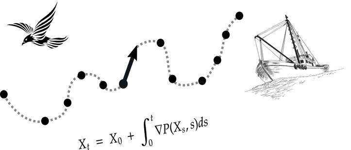

Curso organizado por:

```{r setup, include=FALSE}
options(htmltools.dir.version = FALSE)
```

```{r, out.width = "70%", fig.align='center', echo=FALSE}

```

---

# Rocío Joo

```{r, out.width = "40%", fig.align='center', echo=FALSE}

```

 * Investigación en estadística aplicada a la ecología y pesquería
 * Doctorado sobre la modelización de trayectorias de embarcaciones pesqueras (Université de Montpellier, Francia)
 * Master en Matemáticas, Estadística y Aplicaciones (Montpellier SupAgro - Université de Montpellier, Francia)
 * Ingeniería Estadística (Universidad Nacional de Ingeniería, Perú)
 
`r  icon::fa("twitter")`  @rocio_joo

`r  icon::fa("envelope")`  rocio.joo@ufl.edu

https://rociojoo.github.io/

---

# Plan para esta tarde:

* Presentar el espacio zoom
* Algunos resultados de la encuesta previa
* Presentaciones de participantes y sus datos
* Cuestionario de entrada
* Visión general del contenido del curso
* Hojas de cálculo

---

# Espacio zoom

* Lista de participantes: nombres, manos
* Micrófono, video
* Chat: preguntas, comentarios, ayudas de asistentes
* Compartir pantallas
* Dividir en salas
* Evitar notificaciones de otros aplicativos o dispositivos

---

# Encuesta previa

Resultados sobre R y estadística de lo que contestaron. 

---

# Presentaciones

* Llamaré individualmente a quienes tienen datos
* Se presentarán brevemente con su grupo si es que usan los mismos datos
* Presentarán sus preguntas de investigación, datos, ideas de análisis, y porqué les interesa llevar este módulo

--

<br></br>

¿Qué presentación les pareció más interesante? 

En el GD: ./R-Rocío/00-Intro Al Curso/Actividades hay un doc

  * Abrirlo
  * Poner la respuesta bajo su nombre

[5 minutos]

---

# Cuestionario de entrada:

Por favor, contesten lo más honestamente posible en el formulario que les pasaré en el chat.

[5 min]

--

¿Vemos los resultados?

---

# Visión general del curso:

--

**1.** Hojas de cálculo: 
  * Preparar datos para el análisis. Buenas prácticas y malas prácticas.

--

**2.** Introducción a R: 
  * R, RStudio, organizar el directorio, manipular objetos, importar y exportar datos, unir sets de datos

--

**3.** Gráficos: 
  * Gramática ggplot, diferentes tipos de gráficos (puntos, boxplots, histogramas, mapas), 
  gráficos interactivos y animaciones.

--

**4.** Modelos mixtos: 
  * Regresión lineal, modelos mixtos, modelos mixtos generalizados: 
  ajuste, validación de modelos e interpretación de salidas

---

# Visión general del curso:


**5.** Modelos de Markov escondido: 
  * Sin y con covariables. Ajuste y diagnóstico en R.
  
--

**6.** Panorama de paquetes en R para el análisis de datos de trayectorias y biologging.

--

**7.** Reportes y presentaciones en R (si alcanza tiempo)

--

**8.** Elaboración del reporte final con sus datos.

--

! La duración de cada sub-módulo dependerá del avance del grupo

---

# Dinámica general

* Explicaciones de mi parte

* Trabajos personales

* Trabajos en grupos (aleatorios o pre-definidos)

* Formularios y documentos a llenar

* Pausas cada 40-50 minutos

* Por favor, hacerme recordar: al final de cada clase, habrá un formulario de salida

* Al principio de las siguientes clases, empezaremos con las dudas que tengan de la clase anterior

* Reglas para las pausas: no dispositivos electrónicos

